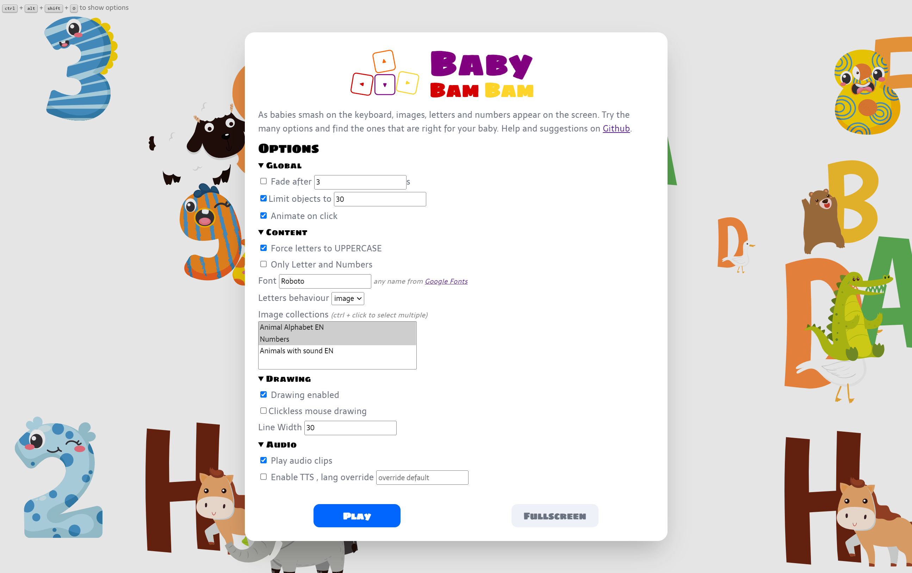
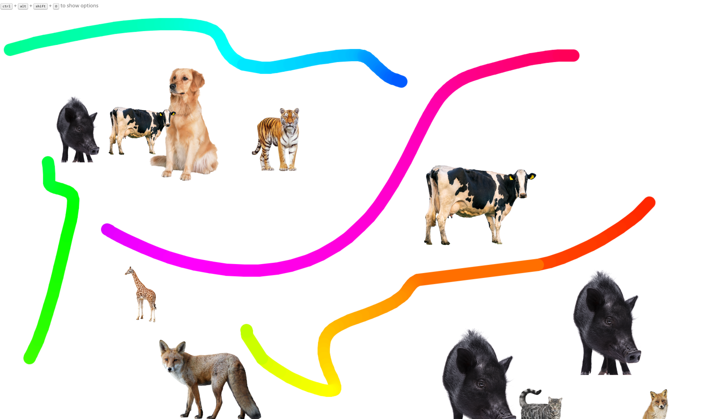

# Baby Bam Bam

As babies smash on the keyboard, images, letters and numbers appear on
the screen. Try the many options and find the ones that are right for your baby.
On chrome fullscreen mode locks keyboard commands like ALT+F4 or tab switching, making it
harder to accidently exit the program.

No dependencies (outside of Google Fonts) only vanilla html/css/javascript.

## Demo
https://bfritscher.github.io/baby-bam-bam/

## Preview

### Options

### Drawing

## Inspired by

- https://github.com/porridge/bambam
- https://github.com/shanselman/babysmash

## Nice to have ##

Some future ideas to be discussed in Issues

- [ ] Handle options screen on mobile? Better touch UX
- [ ] Optimise images / create more assets
- [ ] Test message sync and multi window api for multiscreen display https://web.dev/multi-screen-window-placement/
- [ ] preload image and sounds with progressbar
- [ ] check performance of draw refresh clear
- [ ] special keys filter not only alphanum to allow for = + - ...

## Content Sources

- https://freeanimalsounds.org/
- https://www.freesoundslibrary.com/
- https://freepik.com
- https://www.rawpixel.com/
- Logo Icon adapted from Simon Mettler from [the Noun Project](https://thenounproject.com/)
